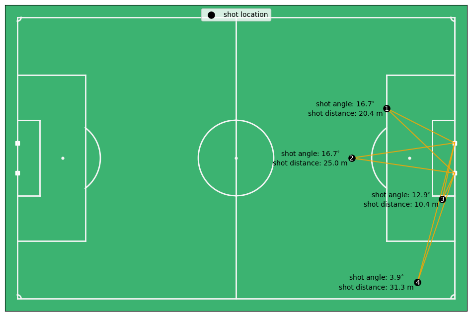
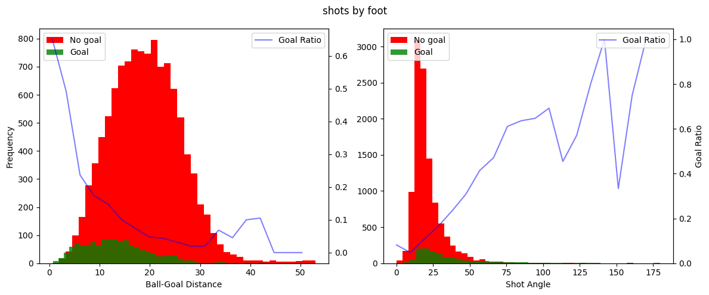
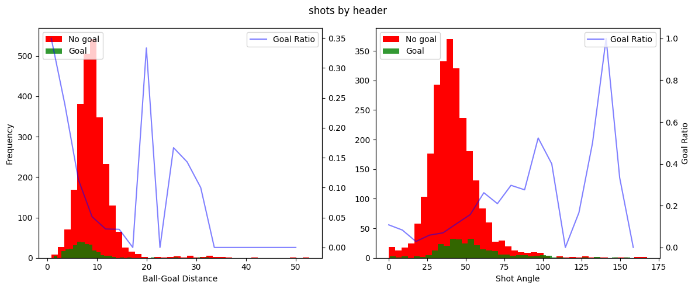
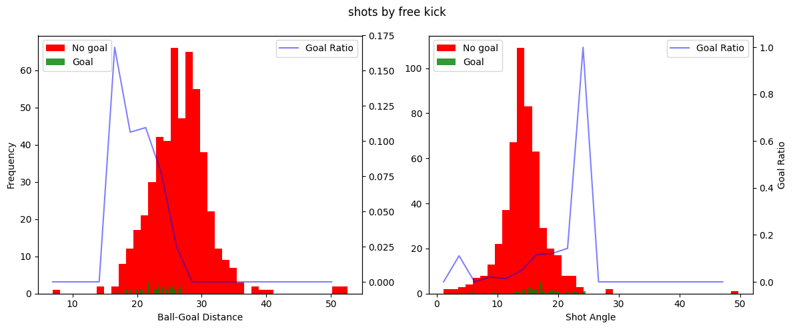
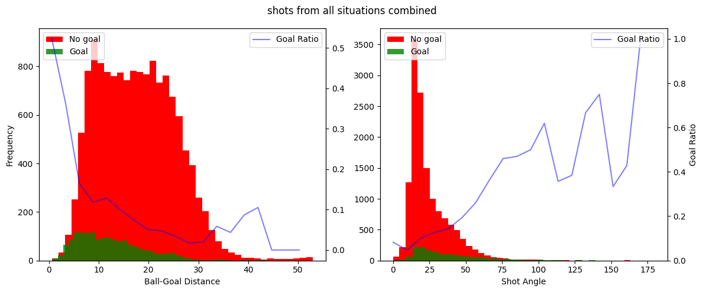
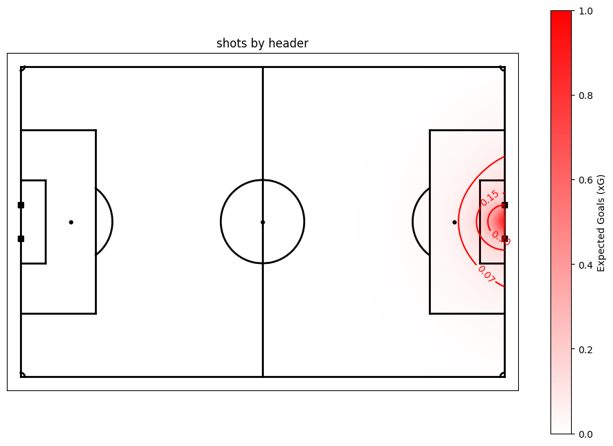
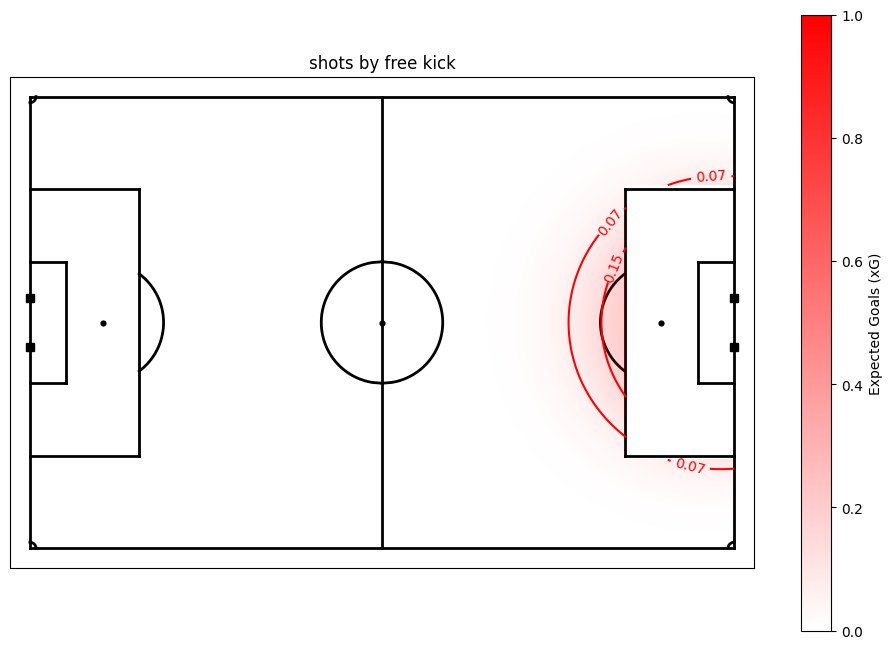

Expected Goals (xG)
-------------------

This is a notebook that creates some simple xG models for the DataBallPy
package. xG is a metric to evaluate the probability that a shot, given
some characteristics of that shot, will turn out to be a goal. xG has
been highly debated and discussed and is used increasingly in practice.
Their is a lot of information about expected goals, but if you want to
read more, I highly recommend the blog posts from the KU Leuven:

-  `How data availability influences xG
   models <https://dtai.cs.kuleuven.be/sports/blog/how-data-availability-affects-the-ability-to-learn-good-xg-models>`__
-  `Illustrating the interplay between features and models in
   xG <https://dtai.cs.kuleuven.be/sports/blog/illustrating-the-interplay-between-features-and-models-in-xg>`__
-  `How data quality affect xG
   performance <https://dtai.cs.kuleuven.be/sports/blog/how-data-quality-affects-xg>`__
-  `Enhancing xG with freeze frame
   data <https://dtai.cs.kuleuven.be/sports/blog/enhancing-xg-models-with-freeze-frame-data>`__

Although we do have tracking data which provides us with the possibility
to create a rather complex xG model, in this notebook we decided to keep
things rather simple for two reasons: (1) The added performance xG
models that use tracking data is low compared to xG models that do not
use tracking data related features, and (2) keeping the model simple
makes it easier to interpretet the model. Lets get started!

.. code:: ipython3

    import pandas as pd
    import numpy as np
    import matplotlib.pyplot as plt
    from matplotlib.colors import LinearSegmentedColormap
    from copy import deepcopy
    
    from sklearn.linear_model import LogisticRegression
    from sklearn.model_selection import train_test_split
    from sklearn.preprocessing import StandardScaler, FunctionTransformer
    from sklearn.metrics import brier_score_loss
    from sklearn.pipeline import Pipeline
    import joblib
    
    from databallpy.features.angle import get_smallest_angle
    from databallpy.visualize import plot_soccer_pitch

.. code:: ipython3

    data = pd.read_csv("../data/shot_features.csv", index_col="Unnamed: 0")
    data["shot_outcome"] = data["shot_outcome"].apply(lambda x: 1 if x=="goal" else 0)

Data preprocessing
~~~~~~~~~~~~~~~~~~

.. code:: ipython3

    # delete all shots from own half, probably an error in the data
    data = data[data["ball_goal_distance"] <= 53].copy()
    
    # create single column that indicates whether the shot was taken by foot or not
    data["is_by_foot"] = data["body_part"].apply(lambda x: 1 if "foot" in x else 0)
    data.drop(columns=["body_part"], inplace=True)
    
    # For this model, we are really only interested in the shot distance and the shot angle
    data = data[["ball_goal_distance", "shot_angle", "is_by_foot", "type_of_play", "shot_outcome"]].copy()
    
    print(data["shot_outcome"].value_counts())
    print(data.info())
    print(data.describe())

.. parsed-literal::

    shot_outcome
    0    14138
    1     1706
    Name: count, dtype: int64
    <class 'pandas.core.frame.DataFrame'>
    Index: 15844 entries, 0 to 41
    Data columns (total 5 columns):
     #   Column              Non-Null Count  Dtype  
    ---  ------              --------------  -----  
     0   ball_goal_distance  15844 non-null  float64
     1   shot_angle          15844 non-null  float64
     2   is_by_foot          15844 non-null  int64  
     3   type_of_play        15844 non-null  object 
     4   shot_outcome        15844 non-null  int64  
    dtypes: float64(2), int64(2), object(1)
    memory usage: 742.7+ KB
    None
           ball_goal_distance    shot_angle    is_by_foot  shot_outcome
    count        15844.000000  15844.000000  15844.000000  15844.000000
    mean            17.069520     26.114796      0.819111      0.107675
    std              7.794867     16.745407      0.384938      0.309979
    min              0.600167      0.022857      0.000000      0.000000
    25%             10.637804     15.295443      1.000000      0.000000
    50%             16.491207     20.207843      1.000000      0.000000
    75%             22.738823     32.808210      1.000000      0.000000
    max             52.992204    179.654562      1.000000      1.000000

Looking at the data, we have a total of 15844 shots, of which 1706 are
actual goals (10.8%). Our baseline model would just assume that every
shot has a 10.8% chance of being a goal, but I think we can do better.
The next step is creating different datasets for different types of
shots. In open play, you either shoot by foot, or with an header
(roughly speaking). Second, we also have set pieces. For penalties, we
know that all features (distance to goal and shot angle) are equal, so
the xG of a penalty is just the success rate of all penalties in our
dataset. For free kicks, the distance and goal angle is variable,
therefore we will also create a model for free kicks specifically. Last,
we will create a xG for all shots, to evaluate if the different types of
shots actually are different in terms of xG or not.

.. code:: ipython3

    open_play_data = data[data["type_of_play"].isin(["regular_play", "corner_kick", "crossed_free_kick", "counter_attack"])]
    free_kick_data = data[data["type_of_play"]=="free_kick"]
    penalty_data = data[data["type_of_play"]=="penalty"]
    foot_data = open_play_data[open_play_data["is_by_foot"] == 1]
    header_data = open_play_data[open_play_data["is_by_foot"] == 0]
    
    all_datasets = [foot_data, header_data, free_kick_data]
    all_shots = pd.concat(all_datasets)
    all_datasets.append(all_shots)
    
    titles = ["shots by foot", "shots by header", "shots by free kick", "shots from all situations combined"]
    print(f"The xG of a penalty in our dataset is {round(len(penalty_data[penalty_data["shot_outcome"]==1]) / len(penalty_data), 3)}\n")
    
    for data, title in zip (all_datasets, titles):
        n_goals = len(data[data["shot_outcome"]==1])
        print(f"We have {len(data)} {title}, of which {n_goals} is a goal ({round(n_goals*100/len(data), 1)}%).")

.. parsed-literal::

    The xG of a penalty in our dataset is 0.792
    
    We have 12322 shots by foot, of which 1281 is a goal (10.4%).
    We have 2866 shots by header, of which 302 is a goal (10.5%).
    We have 536 shots by free kick, of which 28 is a goal (5.2%).
    We have 15724 shots from all situations combined, of which 1611 is a goal (10.2%).

The percentage goals for the in play subsets seems to be relatively
stable. For the free kicks here is a lower percentage of goals scored.
Also note that the total shots and goals has decreased slightly since we
excluded the penalties. However, this is still very describtive, lets
look at the relation between the features and the goals scored.

Data exploration
~~~~~~~~~~~~~~~~

.. code:: ipython3

    def get_shot_angle(x:float, y:float) -> float:
        """Given a x, y coordinate, calculates the angle in degrees between 
        the vector from the ball to the left post and the vector form the ball 
        to the right post."""
        
        ball_xy = np.array([x, y])
        left_post_xy = np.array([53, 3.66])
        right_post_xy = np.array([53, -3.66])
        
        ball_left_post_vector = left_post_xy - ball_xy
        ball_right_post_vector = right_post_xy - ball_xy
        
        angle = get_smallest_angle(
                ball_left_post_vector, ball_right_post_vector, angle_format="degree"
        )
        return angle
    
    left_post_xy = np.array([53, 3.66])
    right_post_xy = np.array([53, -3.66])
    
    x_locs = [53-16.5, 52-24, 53-3, 53-9]
    y_locs = [12, 0, -10, -30]
    fig, ax = plot_soccer_pitch()
    ax.scatter(x_locs, y_locs, label="shot location", color="black", s=90)
    n = 1
    for x, y in zip(x_locs, y_locs):
        ax.plot([x, left_post_xy[0]], [y, left_post_xy[1]], color="orange", alpha=0.8, zorder=-.05)
        ax.plot([x, right_post_xy[0]], [y, right_post_xy[1]], color="orange", alpha=0.8, zorder=-.05)
        ax.text(x, y-0.15, str(n), color="white", fontsize=10, ha="center", va="center")
        n += 1
        shot_angle = get_shot_angle(x, y)
        distance = np.sqrt((x-53)**2 + y**2)
    
        angle_text = f"shot angle: ${shot_angle:.1f}^{{\\circ}}$"
        distance_text = f"shot distance: {distance:.1f} m"
        ax.text(x-10, y + 1, angle_text, color="black", fontsize=10, ha="center", va="center")
        ax.text(x-10, y - 1.3, distance_text, color="black", fontsize=10, ha="center", va="center")
    
    ax.legend(loc= "upper center")
    plt.show()
        

Before really going into the data exploration, it is good to talk about
what the features actually mean. The distance is the distance of the
ball till the center of the goal in meters. The angle is the angle
between two vectors: (1) the vector between the shot location and the
right post, and (2) the vector between the shot location and the left
post. The shot angle is therefore a function of the distance to the goal
and the angle with the goal. For instance, the shot angle for shot 1 and
2 are almost equal, but shot 1 is closer to the goal, however, it is
also moved out to the side more. Shot 3 and 4 are perfectly aligned
between each other, but shot 4 has an angle of 4 degrees and shot 3 of
13 degrees. This is of course because the distance to the goal is a lot
higher for shot 4 compared to shot 3.

Now that you have a feel for the features we use, lets look at how they
relate with goal scoring probabilities.

.. code:: ipython3

    for data, title in zip(all_datasets, titles):
    
        fig, (ax1, ax3) = plt.subplots(1, 2, figsize=(12, 5))
        
        # distances
        bins_distances = np.linspace(data["ball_goal_distance"].min(), data["ball_goal_distance"].max(), 20)
        hist_goals_dist= np.histogram(data.loc[data["shot_outcome"]==1, "ball_goal_distance"], bins=bins_distances)[0]
        hist_total_dist = np.clip(np.histogram(data["ball_goal_distance"], bins=bins_distances)[0], a_min=1e-5, a_max=None)
        
        percentage_goals_distances = hist_goals_dist / hist_total_dist
        ax1.hist(data.loc[data["shot_outcome"]==0, "ball_goal_distance"], bins=40, color="red", label="No goal")
        ax1.hist(data.loc[data["shot_outcome"]==1, "ball_goal_distance"], bins=40, color="green", alpha=0.8, label="Goal")
        ax1.set_xlabel('Ball-Goal Distance')
        ax1.set_ylabel('Frequency')
        
        ax2 = ax1.twinx()  
        ax2.plot(bins_distances[:-1], percentage_goals_distances, color="blue", label="Goal Ratio", alpha=0.5)
        ax1.legend(loc="upper left")
        ax2.legend(loc="upper right")
    
        # angles
        bins_angles = np.linspace(data["shot_angle"].min(), data["shot_angle"].max(), 20)
        hist_goals_angles = np.histogram(data.loc[data["shot_outcome"]==1, "shot_angle"], bins=bins_angles)[0]
        hist_total_angles = np.clip(np.histogram(data["shot_angle"], bins=bins_angles)[0], a_min=1e-5, a_max=None)
        percentage_goals_angles = hist_goals_angles / hist_total_angles
        ax3.hist(data.loc[data["shot_outcome"]==0, "shot_angle"], bins=40, color="red", label="No goal")
        ax3.hist(data.loc[data["shot_outcome"]==1, "shot_angle"], bins=40, color="green", alpha=0.8, label="Goal")
        ax3.set_xlabel('Shot Angle')
        
        ax4 = ax3.twinx()
        ax4.plot(bins_angles[:-1], percentage_goals_angles, color="blue", label="Goal Ratio", alpha=0.5)
        ax4.set_ylabel("Goal Ratio")
        ax3.legend(loc="upper left")
        ax4.legend(loc="upper right")
    
        fig.suptitle(title)
        fig.tight_layout()
        plt.show()

This is very interesting! We can clearly see a few things. Firstly, for
the shot distance you can see an exponentional decreasing ratio of shots
being scored as the distance to the shot to the goal increases.
Secondly, there seems to be a linear increase in the ratio of shots
being scored with the increase of the shot angle. It seems that these
variables do indeed hold information about whether a shot is going to be
a goal or not. You can also clearly see that the goal ratio values
become more and more random as we have less samples, for instance when
shots are taken from more than 30 meters or in general in the free kick
data.

Building the xG models
~~~~~~~~~~~~~~~~~~~~~~

We will build the expected goal models for every type of shot. For this
we will simply use a logistic regression since it is easiest to
interpretet.

.. code:: ipython3

    models = {}
    scalers = {}
    random_state=42
    
    for data, title in zip(all_datasets, titles):
        y = data["shot_outcome"].copy().astype("category")
        X = data[["ball_goal_distance", "shot_angle"]].copy()
    
        X_train, X_test, y_train, y_test = train_test_split(X, y, test_size=0.2, stratify=y, random_state=random_state)
        
        scaler = StandardScaler()
        X_preprocessed = scaler.fit_transform(X_train.values)
        scalers[title] = scaler
        
        logistic_reg = LogisticRegression(solver="liblinear")
        logistic_reg.fit(X_preprocessed, y_train)
        models[title] = logistic_reg
    
        X_test_preprocessed = scaler.transform(X_test.values)
        y_pred_proba = logistic_reg.predict_proba(X_test_preprocessed)[:, 1]
        
        brier_loss = round(brier_score_loss(y_test, y_pred_proba), 3)
        beta_values = logistic_reg.coef_[0]
        print(f"For the {title}: Brier Score Loss: {brier_loss}")
        for i, col in enumerate(["shot distance", "shot angle"]):
            print(f"\t{col} beta: {round(beta_values[i], 3)}")

.. parsed-literal::

    For the shots by foot: Brier Score Loss: 0.083
    	shot distance beta: -0.611
    	shot angle beta: 0.317
    For the shots by header: Brier Score Loss: 0.09
    	shot distance beta: -0.579
    	shot angle beta: 0.215
    For the shots by free kick: Brier Score Loss: 0.057
    	shot distance beta: -0.816
    	shot angle beta: 0.083
    For the shots from all situations combined: Brier Score Loss: 0.086
    	shot distance beta: -0.441
    	shot angle beta: 0.319

Inspecting the models
~~~~~~~~~~~~~~~~~~~~~

Looking at the brier score losses, we see that the models have
definately trained pretty good. With more data, more complex models and
more complex features we could do better, but for the simplest possible
model, I am happy with these initial results. The Brier score indicates
that the free kick model was best fitted, even though we now that model
had the least data. This is probably because the ratio of free kicks
being scored was very low (5%), therefore the model can perform really
well by guessing every shot is no goal, let’s hope, that is not what the
model learned.

Taking it a step further, we can look at the beta values. Personally, I
would expect negative beta values for the distance feature (greater
distance makes it harder to score) and postive values of the shot angle
feature (greater shot angle means you are either closer or more in front
of the goal, making it easier to score).

Looking at the results we see that indeed the distance beta value is
negative for all models, with values between -0.82 and -0.44. This shows
that a greater distance is decreasing the chance of scoring more for
free kicks than for regular play shots by foot and headers. The beta
angle values are all positive, also as expected. Looking at the beta
values we can see that in all models the distance variable was the most
important in predicting whether a shot will be a goal.

Lets look at some visualizations to confirm that the model predicts
intuitive xG values.

.. code:: ipython3

    x_range = np.linspace(0, 53, 200)  
    y_range = np.linspace(-34, 34, 200)   
    x, y = np.meshgrid(x_range, y_range)
    goal_x, goal_y = 53, 0
    distance = np.sqrt((x - goal_x) ** 2 + (y - goal_y) ** 2)
    angle = np.vectorize(get_shot_angle)(x, y)
    
    colors = [(1, 0, 0, alpha) for alpha in np.linspace(0.001, 1.0, 256)]
    custom_cmap = LinearSegmentedColormap.from_list('custom_red', colors)
    
    for title in titles:
        X_heatmap = np.column_stack((distance.ravel(), angle.ravel()))
        preprocessing_pipeline = preproc_pipelines[title]
        X_heatmap_preprocessed = preprocessing_pipeline.transform(X_heatmap)  
        model = models[title]
        xG_values = model.predict_proba(X_heatmap_preprocessed)[:, 1]
        xG_matrix = xG_values.reshape(x.shape)
    
        if title == "shots by free kick":
            mask = (np.abs(y) < 20.5) & (x > 37)
            xG_matrix[mask] = np.nan
        
        fig, ax = plot_soccer_pitch(pitch_color="white")
        im = ax.imshow(xG_matrix, extent=[0, 53, -34, 34], origin='lower', cmap=custom_cmap, vmin=0, vmax=1)
        cax = fig.colorbar(im, ax=ax) 
        cax.set_label('Expected Goals (xG)')
        contour = ax.contour(x, y, xG_matrix, colors='red', levels=[0.07, 0.15, 0.3], linestyles='solid')
        ax.clabel(contour, inline=True, fontsize=10)
    
        ax.set_title(title)

.. image:: xG_images/output_14_0.png

.. image:: xG_images/output_14_3.png

The xG model for the shots by foot in regular play and of all shots are
pretty similar. This is because most shots in our dataset were shots by
foot in regular play. You can also clearly see that the distance
component is more limiting for the headers than for the shots. On top of
that, it is interesting to see that free kicks from just outside the box
have a twice as high probability of being a goal than regular shots do,
so shooting from that distance out of a free kick can be justified. Over
all, we can see that creating xG models for different types of shots
seems to be better than one single xG model for all shots. Let’s save
the models so we can use it in DataBallPy!

Saving the models
~~~~~~~~~~~~~~~~~

.. code:: ipython3

    save_dir = "../databallpy/models"
    
    for title, save_name in zip(titles[:-1], ["xG_by_foot_pipeline", "xG_by_head_pipeline", "xG_free_kick_pipeline"]):
        prerpoc_pipeline = preproc_pipelines[title]
        model = models[title]
        pipeline = Pipeline([
            ("Preprocessor", prerpoc_pipeline),
            ("log_reg", model),
            ])
    
        joblib.dump(pipeline, f"{save_dir}/{save_name}.pkl")

.. code:: ipython3

    # shortly check if saving the models went right
    distance = 16 # meters
    angle = np.rad2deg(np.arctan(3.66 / 16) * 2) # directly in front of the goal
    
    for save_name in ["xG_by_foot_pipeline", "xG_by_head_pipeline", "xG_free_kick_pipeline"]:
        xg = joblib.load(f"{save_dir}/{save_name}.pkl")
        print(save_name)
        print("\t", round(xg.predict_proba(np.array([[distance, angle]]))[:, 1][0], 3))

.. parsed-literal::

    xG_by_foot_pipeline
    	 0.11
    xG_by_head_pipeline
    	 0.03
    xG_free_kick_pipeline
    	 0.204

