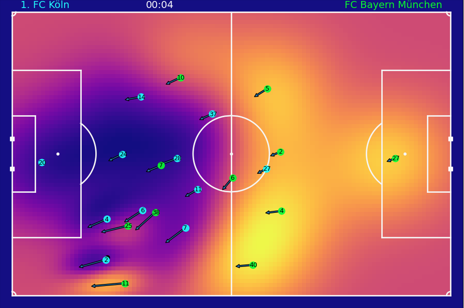

# Summary

Over the last decade, there has been a growing interest in soccer analytics from different backgrounds and for different use cases. Examplary use cases are: first, practical decision making and benchmarking of players based on aggregated metrics such as pass success percentage and expected goals (xG) [@Goes2020a]. Second, using internal and external load metrics for training periodization and injury predictions [@Hader2019]. Third, basic behavioural science soccer with a focus on group and subgroup behaviour[@Goes2020b]. The interest in soccer analysis has also increased since data has become more openly available [@Bassek2025]. However, a key challenge is that every data provider uses their own data format, which makes it hard to compare and switch between different providers and create large datasets that encompass different leagues and competitions. Currently, open-source packages like [Kloppy](https://kloppy.pysport.org) try to overcome this challenge by providing a uniform data format. Similarly, the scientific side proposes a common data format for soccer game data [@Anzer2025]. While Kloppy focuses primarily on parsing soccer data, Floodlight [@Raabe2022] delivers a framework for physical analysis of team sports, and [mplsoccer](https://github.com/andrewRowlinson/mplsoccer) is widely utilized for visualising soccer data. 

Lately, there has been a growing interest in combining event and tracking data for contextualised tactical analysis of soccer games. This provides the possibility to not only know that a pass happened at a specific moment in the match (event data) but also what the defensive structure was during this pass [@Forcher2022; @Herold2022], and what other passing options were available at this moment (tracking data) [@Spearman2017]. Contextual analysis goes beyond aggregated metrics and provides the ability to do quantitative analysis of single moments or specific phases in the game [@Oonk2025a; @Jerome2024]. Merging tracking and event data is a key challenge for contextualised analysis of soccer games. [`DataBallPy`](https://databallpy.readthedocs.io/en/latest/) is an open source python package for contextual analysis of soccer games because (1) it uses a standardized data format for both event and tracking data, (2) it provides a framework where all data of a game is bundled, instead of considered as seperate data objects, (3) it includes a high quality and learning free synchronsiation algorithm that works on any combination of tracking and event data providers, and (4) it has integrated multiple practical and scientific features within the package that allow for efficient computation with minimal user input. 


# Statement of need

Modern soccer analytics increasingly rely on both event data and tracking data for a comprehensive analysis. Event data captures specific information about events (e.g., passes and shots) like their location, success, start location, and the athlete involved in the action. This information on itself is primarily aggregated for tactical game and player analysis [@Goes2020a] but is also widely used in scouting because of the low cost and widespread availability of the data [@vanArem2025]. Tracking data, on the other hand, captures spatiotemporal information of all athletes and the ball at frequencies ranging between 10 and 25 Hz [@Linke2020]. This data is primarily used to quantify physical performance, but also for the detection of dynamic formation [@sotudeh2025], detection of events [@Vidal-Codina2022], detection of game phases [@Bauer2023], space occupation [@Spearman2017; @Rein2017], and quantification of dangerousity [@Link2016]. 

The currently avaiable packages allow for parsing ([Kloppy](https://kloppy.pysport.org)) and analysis [@Raabe2022] of either data stream independently. However, there has been a growing interest in combining event and tracking data to enrich event information with spatiotemporal context. This added context provides insights and nuances, primarily on a tactical level, that neither event nor tracking data can provide independently. For example, shot events are enriched with information about defensive and keeper positioning to create better expected goals models [@Anzer2021], passes are evaluated by making risk reward assessments of all possible passing options [@Goes2021], determinants of successful 1v1 actions are modelled from spatiotemporal features [@Oonk2025a], and the spatiotemporal context of events is used to predict dangerousity of a game state [@Fernandez2021]. A contextual analysis requires a proper synchronisation of event and tracking data, and a convenient data structure for further analysis. Current packages either have a separation between event and tracking data with limited options to combine them [@Raabe2022], or focus only on the synchronistation approach, limiting the convenient data structure to start your analysis after merging the data streams [@VanRoy2024; @Kim2025]

`DataBallPy` addresses this gap by combining all game-related data in a standardized `Game` object. The `Game` object includes event, tracking, and metadata. The primary feature of `DataBallPy` is the robust and efficient synchronistation between event and tracking data. Although event and tracking data often both provide timestamps, their alignment has shown to be extremely poor with reported errors of 1.82 (+-4.06) seconds [@Anzer2021]. Especially, the random error is concerning since it does not allow for easy correction, and within 4 seconds, the game might have evolved to an entirely different situation. Although specific approaches have been introduced to solve this problem, they can take between 3 and 10 minutes per game of runtime, may skip certain events, and potentially shuffle the order of events [@VanRoy2024; @Kim2025]. `DataBallPy` allows for a state of the art synchronisation algorithm that ensures the synchronisation of all events in the right order within a few seconds [@Oonk2025b] in just one line of code. @Oonk2025b showed that the expected goals model decreased in Brier loss from 0.096 to 0.082 (lower is better) when using the synchronisation in `DataBallPy` compared to a naive timestamp synchronisation. Similarly, the feature importance of features that relied on combined tracking and event data information was close to 0 in the timestamp synchronisation model, which was not the case for the `DataBallPy` synchronisation model [@Oonk2025b]. 

Next to the practical value of `DataBallPy`, as it provides low-code access to scientific features (see the Features section below), `DataBallPy` also serves as an educational tool. Often, open-source Python packages provide information on how to get working code, but not on how the code works. `DataBallPy` explicitly goes a step further by elaborately explaining step by step how scientific papers are transformed into code, often referring to specific mathematical formulas as presented in the paper. These explanations are crucial since it (1) allows researchers and practitioners to better understand the strengths and weaknesses of features, and (2) teaches users how to transform scientific papers into modular, Pythonic code. Both these characteristics provide users of `DataBallPy` a better understanding of their own analysis.


# Features

The features and functionalities in `DataBallPy` can be categorised into five categories: parsing data, preprocessing, synchronisation, performance indicators, and visualisation. 

## Parsing Data

The core goal of parsing data in `DataBallPy` is obtaining a `Game` object. `DataBallPy` allows for parsing data from different commercial data providers such as Tracab, Metrica, Inmotio, Opta, Instat, SciSports, Sportec, and Statsbomb internally using the `get_game` function. The `Game` object contains the event and tracking data internally as Pandas dataframes, making them intuitive to work with [@reback2020pandas]. Alternatively, one can use [Kloppy](https://kloppy.pysport.org/) to parse data from differnt providers and use the `get_game_from_kloppy` function to transform the Kloppy event and tracking datasets into a `Game` object. Last, `DataBallPy` has included a function to load openly available data directly in a `Game` object using `get_open_game`, which allows users who do not have access to data to still work with soccer data in `DataBallPy` [@Bassek2025]. Since the combination of parsing and (pre)processing a single game of data can take anywhere between 30 seconds and a few minutes on a standard device (which is similar to other packages), `DataBallPy` also allows one to efficiently save the preprocessed `Game` object as parquet and JSON files. This has two main benefits. First, using the `get_saved_game` function, you can now obtain a preprocessed game object in milliseconds instead of minutes, and second, raw tracking data files can be up to 400 MB per game, while the saved `DataBallPy` Game objects that include both event and tracking data are generally between 20 and 100 MB of memory.

## Preprocessing

Tracking data is often captured via video footage using computer vision. Depending on the quality and number of cameras, some noise is present in both the athlete and ball positions [@Linke2020]. `DataBallPy` allows for filtering of the ball and positional data as well as differentiation of positions to compute velocity and acceleration. Furthermore, the tracking data allows for computation of individual athlete possession [@Vidal-Codina2022], and together with the event data, team-level possession can be estimated. 

## Synchronisation

`DataBallPy` uses a soccer-specific implementation of the Needleman-Wunsch algorithm to synchronise the event and tracking data, which is more elaborately described in [@Oonk2025b]. The game can be synchronised using the following code
```python
>>> from databallpy import get_open_game
>>> game = get_open_game()
>>> game.synchronise_tracking_and_event_data()
```

## Performance Indicators

`DataBallPy` has an elaborate list of scientific features included in the package. All features can be computed in a few lines of code after obtaining a `Game` object. Next, the functionality, the documentation covers an elaborate explanation of how the code works that computes the features, which enables a clear reporting and reproduction of results. Using `DataBallPy`, the following features can be computed:

- Covered Distance (in specific velocity and acceleration zones) [@Jerome2024]
- Pressure [@Andrienko2017; @Herold2022]
- Individual player possession [@Vidal-Codina2022]
- Expected Goals [@Anzer2021]
- Expected Threat [@Singh2019]
- Voronoi Space Occupation [@Rein2017]
- Pitch Control [@Fernandez2018]
- Dangerous Accessible Space [@Bischofberger2025]

## Visualisation



`DataBallPy` includes elaborate functionality to visualise the data in the `Game` object. Event locations can be visualised on a pitch using the `plot_events()` function, which allows for coloring of events by outcome, team, or event type during specific periods in the game. Similarly, the locations and velocities of all players can be plotted using `plot_tracking_data()` function. If the event and tracking data are synchronised, one can also show information about the event in the same plot. Other features like pitch control heatmaps, player possession, and any custom feature can also be visualised simultaneously with the event and tracking data (Figure 1). Last, the tracking data (with heatmaps and custom features) can be transformed into a video (mp4) to show the true spatiotemporal progression over time.


```Python
import matplotlib.pyplot as plt

from databallpy import get_open_game
from databallpy.visualize import plot_tracking_data

game = get_open_game()
game.tracking_data.add_velocity(game.get_column_ids() + ["ball"])

pitch_control = game.tracking_data.get_pitch_control(
    game.pitch_dimensions,
    start_idx=100,
    end_idx = 101
)


fig, ax = plot_tracking_data(
    game,
    idx=100,
    add_velocities=True,
    heatmap_overlay=pitch_control[0],
    overlay_cmap="plasma",
    team_colors=["#00FFFF", "#00FF00"]
)
plt.show()
```

# Research impact statement

`DataBallPy` has shown to be increasingly used by coders, practitioners, and researchers. The packages has been dowloaded over 47.000 times on PyPI, averaging more than 250 downloads per week. The project has over 60 GitHub stars. Issues and PR's are being opened by users outside of the network of the original owners and maintainers. On top of that, `DataBallPy` has been mentioned in numerous published scientific papers [@Robertson2023; @Anzer2025; @Zhang2025; @Oonk2025a]. Moreover, the largest currently open-sourced dataset of tracking and event data showcased how `DataBallPy` can be used to synchronise the two sources [@Bassek2025]. Last, authors that introduce new metrics propose to open a PR with their metric so it is easily available for the scientific community [@Bischofberger2025]. Together this shows that `DataBallPy` has a wide range of users and the package is growing outside of the reach of the original owners and maintainers.

# AI usage disclosure

No generative AI tools were used in the writing of this manuscript and the development of the core functionalities and architecture of `DataBallPy`. With the exception of unittests, there is no explicit restriction on the usage of generative AI in the further development of `DataBallPy` (e.g. optimizing code, docstrings, reviewing, writing documentation, etc.). All code and documentation is checked and verified by human maintainers before merging into the code base.

# References
